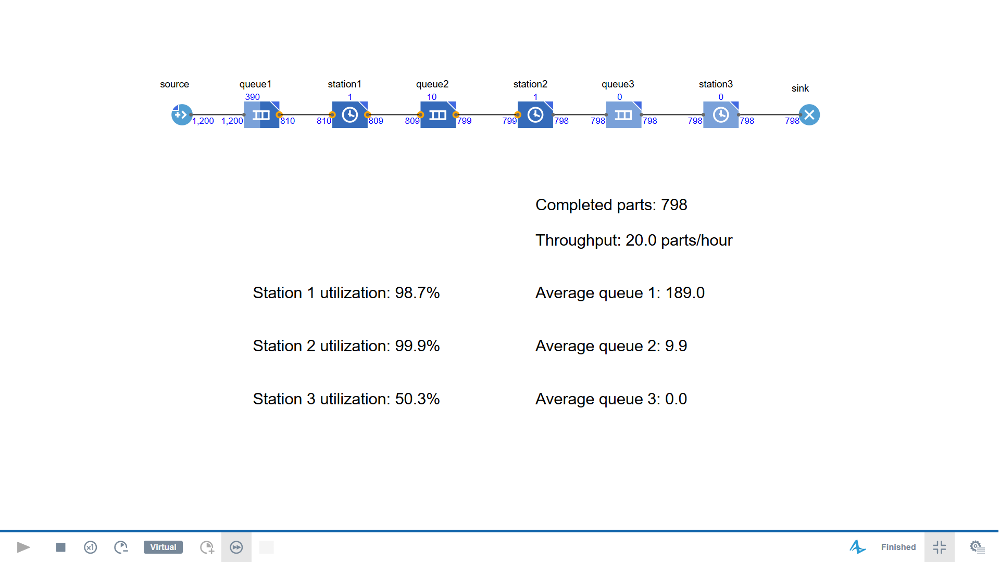

# Production Line Simulation with AnyLogic

A discrete-event simulation of a three-station production line, built with AnyLogic PLE 8.9.10 and the Process Modeling Library.

## Model

Parts pass through three processing stations, each preceded by a queue.

- Arrival interval: 2 minutes
- Station capacity: 1 part per station
- Input queue capacity: 1,000 parts
- Intermediate buffer capacities: 10 parts each
- Simulation duration: 2,400 minutes
- System initially empty

### Processing times

| Station | Distribution in minutes | Mean |
|---|---|---:|
| Station 1 | triangular(0.5, 1, 1.5) | 1.0 |
| Station 2 | triangular(2, 3, 4) | 3.0 |
| Station 3 | triangular(1, 1.5, 2) | 1.5 |

These distributions are illustrative assumptions, not measured production data.

## Example Run

| Metric | Result |
|---|---:|
| Completed parts | 798 |
| Throughput | 19.95 parts/hour |
| Station 1 capacity occupancy | 98.7% |
| Station 2 capacity occupancy | 99.9% |
| Station 3 capacity occupancy | 50.3% |
| Average queue 1 length | 189.0 |
| Average queue 2 length | 9.9 |
| Average queue 3 length | 0.0 |

The dashboard displays throughput as 20.0 parts/hour after rounding to one decimal place.

Station occupancy uses the Delay block's utilization statistic. It includes time spent holding a completed part while waiting for downstream space.

## Observations

Station 2 is the bottleneck. Its mean processing time limits nominal capacity to approximately 20 parts/hour.

The arrival rate is 30 parts/hour, so parts accumulate upstream. Station 3 has spare capacity and its queue remains effectively empty.

These results describe one stochastic run over the full simulation period, including startup. Multiple replications would be needed to quantify uncertainty.

## Screenshot

## Files

- `ProductionLine.alp` — AnyLogic model
- `simulation-results.png` — example simulation results

## How to Run

1. Download this repository.
2. Open `ProductionLine.alp` in AnyLogic PLE 8.9.10.
3. Run the Simulation experiment.
4. Observe completed parts, throughput, station occupancy, and average queue lengths.
